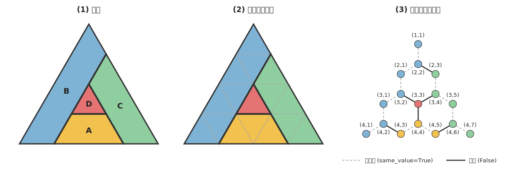
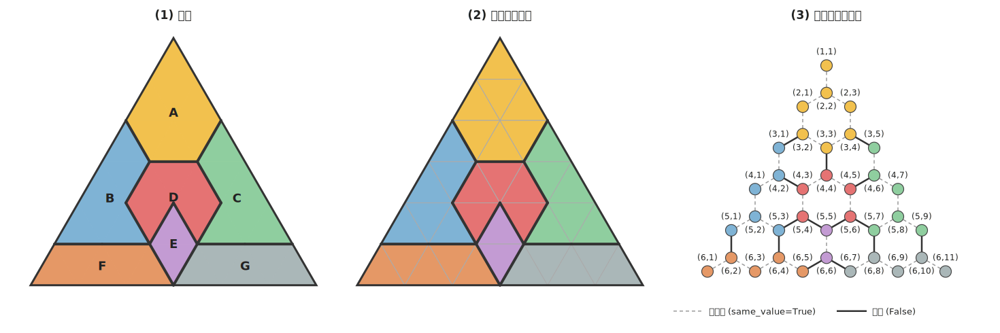
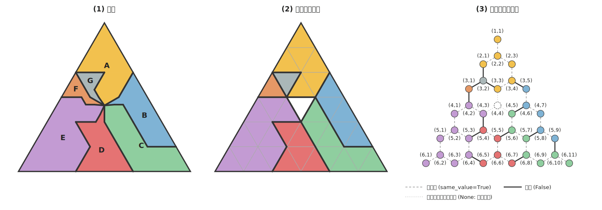

# 説明資料: 地図をハニカムグラフで表現する

四色問題プロジェクトの基礎となる「地図のハニカムグラフ表現」を、
2つのサンプルと Python 上のデータ構造で説明する。

- サンプル01: [samples/sample01_k4.py](../samples/sample01_k4.py)（4カ国・4色が必要な最小の例）
- サンプル02: [samples/sample02_seven.py](../samples/sample02_seven.py)（7カ国・少し大きい例）
- サンプル03: [samples/sample03_point.py](../samples/sample03_point.py)（7カ国が1点に集まる例・無色ノード）

---

## 1. なぜこの表現を使うのか

四色問題が扱う「地図」は、国の形も数も国境の曲がり方も千差万別で、
そのままではアルゴリズムの対象にしにくい。
そこで、**どんな地図も同じ土俵に乗せる正規化された表現**としてハニカムグラフを使う。

この表現で手に入るもの:

1. **座標** — すべてのノードに (r, p) という番地が付く
2. **走査順** — 番地があるので「(1,1) → (2,1) → (2,2) → …」のような順番が定義できる
3. **隣接数の上限** — どのノードも隣接ノードは最大3個
4. **単純なデータ構造** — 地図全体が「エッジの辞書」1つで書ける（§4）

注意: この表現は問題を**易しくする**ものではない（色の制約は国単位で効くため、
国同士の隣接数は元の地図のまま）。あくまで**実験と実装のための正規化**である。

## 2. ハニカムグラフとは

蜂の巣（六角形の敷き詰め）模様の、線の交点を「ノード」、線を「エッジ」と
みなしたグラフのこと。蜂の巣の交点にはどこも線が3本しか集まらないので、
**各ノードの隣接数は最大3** になる。

そして幾何学的に重要な対応がある:

> ハニカム格子の頂点は、**三角格子の小三角形と1対1に対応する**（双対関係）。

つまり、

1. 地図が描かれた大きな三角形を、小さな三角形に分割する
2. 各小三角形がノード。辺を共有する小三角形同士がエッジで結ばれる
3. 小三角形は ▲（上向き）と ▽（下向き）が交互に並び、
   どの三角形も**辺を共有する相手は最大3個**
4. ノード（=小三角形の重心）とエッジを点と線で描き直すと、蜂の巣模様が現れる

サンプルの3面図はこの手順そのものを示している:
**(1) 地図 → (2) 三角形に分割 → (3) ハニカムグラフ**。

## 3. 表現のルール

1. 盤面は1辺 size 個の小三角形に分割された正三角形（ノード総数 size²）
2. 各ノードはちょうど1つの国に属するか、**無色ノード**（どの国にも属さない。§6）
3. **国は連結** — 1つの国は「つながった小三角形の集まり」（飛び地は今は扱わない）
4. 各エッジは属性 `same_value` を持つ:
   - `True` … 両端が同じ国（国の内部）
   - `False` … 両端が違う国（**国境**）
   - `None` … 少なくとも一方が無色ノード（**制約なし**。§6）
5. 塗り分けの制約は **国境エッジ（False）だけ**に効く:
   両端のノード（=国）は違う色でなければならない。
   `True` のエッジは「両端は同じ色」を意味するが、同じ国なので自動的に満たされる。
   `None` のエッジは何も要求しない。無色ノードには色を塗らない。

## 4. サンプル01 — 最小の例（4色が必要）



中央の小さな国 D を A・B・C が取り囲み、**4つの国が互いにすべて隣接する**地図。
国の隣接関係はグラフ理論でいう K4（4頂点の完全グラフ）になる。

| 項目 | 値 |
|---|---|
| 盤面 / ノード数 / エッジ数 | 1辺4 / 16 / 18 |
| 内部エッジ / 国境エッジ | 12 / 6 |
| 最大隣接数 | 3 |
| 彩色 | 4色で可、**3色では不可** |

見どころ:

- 国の組は 4C2 = 6通りあり、国境エッジもちょうど6本。
  **どの2国もちょうど1本のエッジで接する**、無駄のない最小構成。
- どの2国も隣接しているので、全部の国に違う色が要る = 4色必要。
  「4色が必要な地図」としてこれより小さい構成は本質的に無い。

## 5. サンプル02 — 少し大きい例（7カ国）



頂上の A、左右の B・C、中央の D、3国に挟まれた小さな E、麓の F・G という7カ国。

```
            A
          A A A
        B A A A C
      B B D D D C C
    B B B D E D C C C
  F F F F F E G G G G G
```

| 項目 | 値 |
|---|---|
| 盤面 / ノード数 / エッジ数 | 1辺6 / 36 / 45 |
| 内部エッジ / 国境エッジ | 30 / 15 |
| 国の数 / 国境の組数 | 7 / 10 |
| 彩色 | **3色で可**、2色では不可 |

サンプル01 に無かった特徴:

- **国境は1本のエッジとは限らない。**
  B–D、C–D、D–E、B–F、C–G はそれぞれ2本のエッジで接している。
  「2国が隣接するか」は「国境エッジが1本以上あるか」で決まる。
- **すべての国が互いに隣接するわけではない。**
  7カ国の組は21通りあるが、実際に接するのは10組だけ（B と C は接しない、など）。
- **4色が常に必要なわけではない。**
  この地図は3色で塗れる（例: A=1, B=2, C=2, D=0, E=1, F=0, G=0）。
  四色定理の「4色」は最悪の場合の保証であり、地図によっては2色や3色で足りる。
- E のように**複数の国（D・F・G）に挟まれた小国**も、連結なノード集合として自然に表せる。

## 6. サンプル03 — 7カ国が1点に集まる例（無色ノード）



地図には「1つの点に多くの国が集まる」場所がありうる。
**点で触れているだけの国同士は隣接する扱いにならない**（同じ色でもよい）—
これが四色問題のルールであり、表現もそれを正しく守る必要がある。

ただし、点の周りで**隣どうし**に並ぶ国は、その点から伸びる国境線で接しているので
普通に隣接する。つまり k カ国が集まる点の周りでは、
国の並び（円順）で隣どうしの k 組だけが隣接し、残りの組は隣接しない。

### 表現のしかた

- **6カ国まで**: 三角形盤の格子点には6個の小三角形が集まれるので、
  普通の格子点がそのまま「最大6カ国が集まる点」になる。特別な仕掛けは不要。
- **7カ国以上**: 1つの格子点では足りないので、点を小さな三角形1個に
  **膨らませて**、それを**無色ノード**にする。
  - 無色ノードはどの国にも属さず、色も塗らない（`country_of` の値は `None`）
  - 無色ノードに接するエッジは `same_value=None`（制約なし）
  - 地図を見る人にとっては「ほぼ点」、グラフにとっては「制約を運ばない穴」

### サンプル03 の構成

1辺6の盤で、無色ノード X=(4,4) の周りを7カ国 A〜G が時計回りに囲む。

| 項目 | 値 |
|---|---|
| ノード数 / エッジ数 | 36 / 45 |
| 内部 / 国境 / 制約なしエッジ | 29 / 13 / 3 |
| 国の数 / 無色ノード | 7 / 1（X に7カ国全部が集まる） |
| 国境の組 | 隣どうしの7組だけ（A-B, B-C, …, G-A） |
| 彩色 | 3色で可（隣接グラフが奇数長の輪 C7 なので2色は不可） |

見どころ:

- 3面図の **(1) 地図 では、7カ国が本当に1点で合流している**。
  分割前の地図にあるのは「点」だけで、膨らませた三角形は (2) 三角形に分割 から現れる。
  つまり (1)→(2) が「点を無色ノードに膨らませる」変換そのものを表している。
  この点縮約の描画は `render.py` が自動で行い、2つの性質を保証している:
  （a）描かれる境界線はすべて本物の隣接（くさびの弧の割り当てと、削る角の選び方による）、
  （b）どの国も**ひとつながり**に見える — 角だけで接する国（B, D, F, G）のくさびは、
  間に挟まる隣国セルの角を少し削った細い通路（スリバー）で本体と正の幅でつながる。
- A と C、B と E のような「隣どうしでない」14組は、点 X で集まっているのに
  **国境を1本も持たない** = 同じ色にしてよい。`check_sample` が機械検証している。
- F と G は点 X に**角だけで接する**1セルの小国。
  辺で接していなくても「その点に集まっている国」に数えられる
  （`meeting_points` は格子点の共有で判定する）。

### 無色ノード1個の容量は12カ国

無色ノードの周りに何カ国まで集まれるか。無色の三角形に「触れる」セルは、

- 辺を共有するセル … 3個
- 角（3つの頂点）だけを共有するセル … 各頂点3個 × 3 = 9個

の計 **12個** が環状に並ぶ。各国は最低1セルでこの環に触れる必要があるので、
**無色ノード1個で表現できるのは最大12カ国**。
3頂点 × 6セル = 18 と数えたくなるが、それは無色ノード自身を3回、
辺を共有するセルを2回ずつ重複して数えており、引くと 18 − 3 − 3 = 12 になる。

実際に12カ国を1セルずつ環に並べた構成が作れることは、
テスト `TestColorlessCapacity`（[tests/test_honeycomb.py](../tests/test_honeycomb.py)）で
機械検証済み。**13カ国以上**が集まる点は、無色ノードを2個以上つなげて
（膨らませた点をさらに太らせて）表現する。

## 7. Python 上のデータ構造

実装は標準ライブラリのみ。地図は最終的に**辞書2つ**（`country_of` と `edges`）で表される。

### 7.1 盤面とノード座標 — `fourcolor/honeycomb.py`

盤面は `HoneycombTriangle(size)`。ノードは座標タプル `(r, p)` で表す。

- `r` = 行（上から 1〜size）
- `p` = 行内位置（左から 1〜2r-1）
- **p が奇数なら ▲（上向き三角形）、偶数なら ▽（下向き三角形）**

隣接ルールはこれだけ:

```python
def neighbors(self, node):
    r, p = node
    candidates = [(r, p - 1), (r, p + 1)]      # 同じ行の左右
    if self.is_up(node):
        candidates.append((r + 1, p + 1))      # ▲ は真下の ▽ へ
    else:
        candidates.append((r - 1, p - 1))      # ▽ は真上の ▲ へ
    return [c for c in candidates if self.is_valid(c)]
```

候補が3つしか無いので、隣接数が最大3であることはコードからも明らか。
最小の盤面 `size=2`（ノード4個）で動かすとこうなる:

```
>>> g = HoneycombTriangle(2)
>>> g.nodes()
[(1, 1), (2, 1), (2, 2), (2, 3)]
>>> g.neighbors((2, 2))      # ▽ は左・右・真上の3方向
[(2, 1), (2, 3), (1, 1)]
>>> g.neighbors((1, 1))      # 盤の角の ▲ は1方向だけ
[(2, 2)]
```

このほか描画用に、小三角形の頂点座標 `triangle_vertices()`、
重心（=グラフのノード位置）`node_center()` などの幾何メソッドを持つ。

### 7.2 地図 = 辞書2つ

**国の割り当て `country_of`** — サンプルを「作る」ときの元データ。
ノード → 国名の辞書で、これが地図のすべてを決める:

```python
COUNTRY_OF = {
    (1, 1): "B", (2, 1): "B", (2, 2): "B", ...   # ノード (r, p) → 国名
    (3, 3): "D",
    (4, 3): "A", (4, 4): "A", (4, 5): "A", ...
}
```

**エッジ辞書 `edges`** — 問題を「解く」ときの入力形式。
`build_edges(grid, country_of)` で機械的に作られる:

```python
edges = {
    ((1, 1), (2, 2)): {'same_value': True},    # 同じ国 B の内部
    ((2, 1), (2, 2)): {'same_value': True},
    ((2, 2), (2, 3)): {'same_value': False},   # B と C の国境
    ...
}
```

- キーは隣接ノードの組（小さい方を先にして正規化。`verify.edge_key()`）
- 無色ノードがある地図では、`country_of` の値が `None`、
  それに接するエッジの `same_value` が `None` になる（§6）
- **「塗られていない地図」とは、この `edges` だけが与えられた状態**を指す。
  彩色アルゴリズムは `edges` を入力とし、`{ノード: 色番号}` の辞書を出力する
  （無色ノードは出力に含まれない）。
  国名すら知らなくてよい — `same_value=True` のエッジを辿れば国は復元できるから。

### 7.3 検証とお手本の彩色

| モジュール | 役割 |
|---|---|
| `fourcolor/mapcheck.py` | **表現の検証。** 全ノードに国があるか、隣接数≤3か、各国が連結か、`same_value` が `country_of` と一致するかを確認し、国境の一覧（どの国とどの国が何本のエッジで接するか）と、無色ノードごとの「その点に集まっている国」の一覧（`meeting_points`。点で接するだけの国も含む）を返す |
| `fourcolor/verify.py` | **彩色の検証。** 彩色結果が全エッジの制約を満たすかを判定する独立の審判。`violations()` が違反の一覧を返す |
| `fourcolor/baseline.py` | **お手本の彩色（オラクル）。** ①same_value=True を Union-Find で縮約 → ②矛盾検査 → ③国同士の隣接グラフを構築 → ④バックトラックで彩色 → ⑤各ノードに色を書き戻す。遅いが確実なので、今後作る本命アルゴリズムの答え合わせに使う |

サンプルはどちらも `check_sample()` で
「表現が正しいこと」「期待どおりの国境関係であること」「何色で塗れるか」を
機械的に検証してから SVG を出力する。再生成は:

```
python samples/sample01_k4.py
python samples/sample02_seven.py
python samples/sample03_point.py
```

### 7.4 ファイル構成（この資料に関係する部分）

```
fourcolor/
├── honeycomb.py   … 盤面・座標・隣接 (§7.1)
├── mapcheck.py    … edges の構築と表現の検証 (§7.2, 7.3)
├── verify.py      … 彩色の検証 (§7.3)
├── baseline.py    … お手本の彩色 (§7.3)
└── render.py      … 3面図 SVG の描画
samples/
├── sample01_k4.py / .svg      … サンプル01 (§4)
├── sample02_seven.py / .svg   … サンプル02 (§5)
└── sample03_point.py / .svg   … サンプル03 (§6)
```

## 8. まとめ

- 地図は「小三角形への分割」を経てハニカムグラフになり、
  `country_of`（作るとき）と `edges`（解くとき）の辞書2つで完全に表せる。
- ノードの隣接数は最大3に固定されるが、**国同士の隣接数は元の地図のまま**。
  四色問題の難しさはこの「国単位の絡み合い」に残っている。
- 多くの国が集まる「点」は無色ノードで表現する。点で触れるだけの国同士は
  隣接にならない、という地図のルールが `same_value=None`（制約なし）として
  データ構造に正しく写る。無色ノード1個で12カ国まで、つなげればそれ以上も表せる。
- 次のステップ: この入力形式に対して
  「インデックス順の貪欲彩色 + 衝突したときの修正（Kempe 鎖）」を実装し、
  2つのサンプルで動きを観察する。
