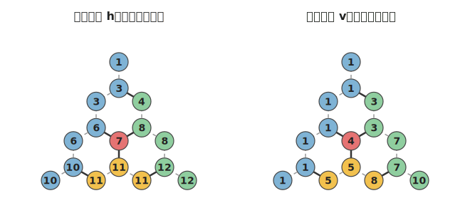
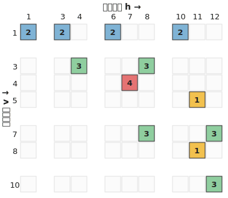
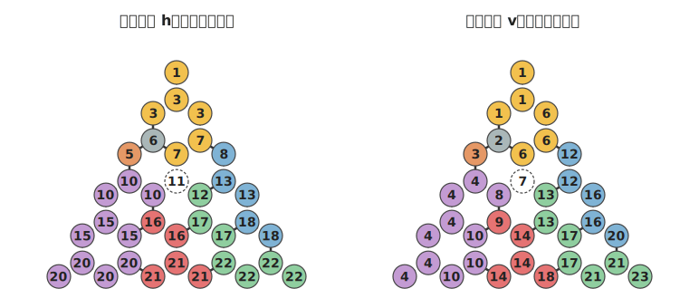
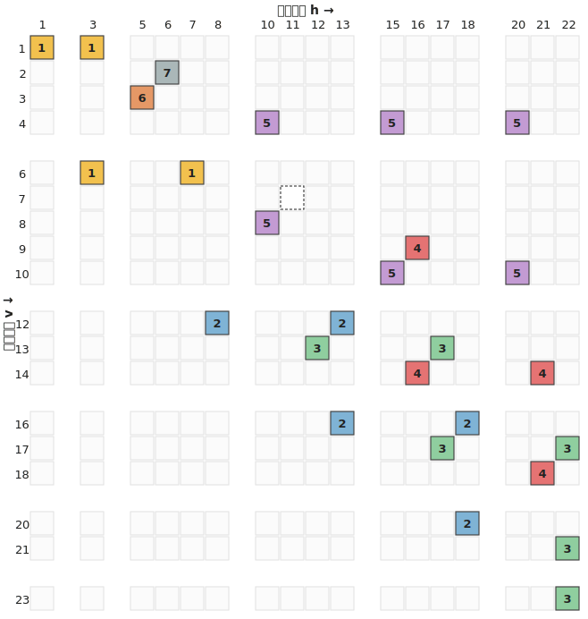

# アイデア: 横ラベル・縦ラベルの2軸表

**状態: 検証済み（同値性が確定）。**
[docs/05](05_アイデア_行ラベリング.md)/[06](06_行ラベリング結果.md) の行ラベリングと
[docs/07](07_アイデア_ラベル4値化.md) の「2レイヤー」概念を、具体的な表として実現したもの。

- 道具・実験: `python experiments/exp3_two_axis_labeling.py`

## 0. 着想

行ラベル `(r, c)` を、2つの値ではなく **1個の整数**にする。
さらに、行（横）だけでなく**列（縦）**方向にも同じ要領でラベルを付け、
横ラベルと縦ラベルを表の2軸にして各ノードを置く。

## 1. 2軸ラベルの作り方

どちらの方向も、行ラベリングと同じ規則（直前との `same_value` が
True→同じ / False→+1 / 無色の次→+2、無色ノードはラベルなし）で番号を振り、
**次の行（列）の先頭は、前の行（列）の最後のラベル +2 から始める**。

**横ラベル**（行スキャン、サンプル01）:

```
 1
 3 3 4
 6 6 7 8 8
 10 10 11 11 11 12 12
```

**縦ラベル**（列スキャン）。列 `k = (p-1)//2` ごとに、盤の左辺に沿う鋸歯状の順序

```
▲(k+1, 2k+1) → ▽(k+2, 2k+2) → ▲(k+2, 2k+1) → ▽(k+3, 2k+2) → …
```

（行間エッジ→行内エッジ→行間…）で辿って番号を振る。サンプル01では:

```
1 1 1 1 1 1 1     ← 1列目(盤の左辺)の7ノード
3 3 4 5 5
7 7 8
10
```

## 2. 表のルール

- **等式ルール**: 横ラベルまたは縦ラベルが同じマスは同色。
- **不等式ルール**: 横ラベルの差が1の2列は別色／縦ラベルの差が1の2行は別色。

## 3. 検証結果（exp3、サンプル01〜03）

| 確認項目 | 結果 |
|---|---|
| (1) 「横同じ ∪ 縦同じ」の推移閉包 = 国の分割 | 3サンプルとも一致 ✓ |
| (2) 「横差1 ∪ 縦差1」から得る異色ペア = `EXPECTED_BORDERS` | 3サンプルとも一致（過不足なし）✓ |

**なぜ過不足が出ないか**（docs/08 の3方向で言うと）:
横ラベル（行スキャン）は行内の2方向＼／を、縦ラベル（列スキャン）は
行間（横）と＼を辿る。合わせて3方向すべてを覆うので、すべての国境を拾える。
ラベルは走査の仕組み上つねに連番なので、「差1」が常に True/False の境界に
一致し、偽の制約が生じない。

## 4. Q1・Q2（同値性の確定）

### Q1: 同じラベルの行・列をまとめても情報は失われないか → **失われない（可逆）**

同じラベルを共有するノードは必ず同じ国（同ラベル = 同セグメント）なので、
列・行をラベル単位でまとめても、別の国が同じマスに潰れて国境が消えることはない。
3サンプルで「1つの (h,v) セルに複数の国が混ざる」例はゼロ。
サンプル01は 16ノード → 12セルに圧縮されるが、彩色情報（国の分割・隣接）は不変。
**まとめた表が、彩色問題としての最小形**。

### Q2: 両ルールを満たして表を塗れば、元の地図を塗れるか → **塗れる（両方向で同値）**

| | 成立 |
|---|---|
| 地図の正しい塗り分け ⟹ 両ルールを満たす | ✓ |
| 両ルールを満たす ⟹ 地図の正しい塗り分け | ✓（exp3 で検証器に通して確認、違反0） |
| **不等式ルールだけ** ⟹ 地図の正しい塗り分け | **✗** |

不等式だけでは不十分な理由: 等式ルール（同ラベル→同色）が**国を1色に糊付け**する
仕事をしている。これが無いと、不等式に縛られないセル同士で
1つの国がバラバラの色に分裂する（例: サンプル01の国Bの4セル
`(h,v)=(1,1),(3,1),(6,1),(10,1)` は互いに差1で結ばれず、別色にできてしまう）。
色数を増やすほど分裂させやすくなるので、色を増やしても直らない。

## 5. 拡張: 区切りを明示する表と仮色値

ライフゲーム的に色を減らす作戦に向けて、表に**区切りの列・行**を持たせる。
横ラベルが +2 で飛んだところ（= 改行・無色ノード）に列を、
縦ラベルが +2 で飛んだところに行を挿入する。

各セルに**仮色値**を持たせ、何らかのアルゴリズムで色数を 4 以下へ減らす。
**無色ノードにも列・行を与える**（表現B）。すると無色ノードが列・行を1つ占め、
規則的な三角階段が保たれる（後述）。セルは4種類あるので、値を数値で統一する:

| 値 | 意味 |
|---|---|
| `1` 以上 | 有色ノードの仮色値。初期値は**国ごとに一意の整数**（= N色の正しい塗り分けから出発） |
| `0` | 無色ノードのセル（実在するノードだが色なし・制約なし。表示 `o`） |
| `-1` | ブロック内だがノードが無い空きセル（表示 `.`） |
| `-2` | 区切りセル（ブロックの外、境界。表示は空白） |

> 符号で「ノードの有無」が読める: **値 `≥ 0` ⇔ そのマスにハニカムのノードがある**
> （有色か無色か）、値 `< 0` ⇔ ノードが無い（空きか区切りか）。
> 空きと区切りを別値にするのは、None で潰すとブロック境界が分からなくなるため。

無色ノードの扱いには2通りある:
- **表現A（飛ばす）**: 無色ノードに列・行を与えず、+2 の飛びを区切りにする。
  → 余分な区切りが行/グループの途中に入り、規則的な三角階段が崩れる。
- **表現B（採用）**: 無色ノードにも列・行を与え `0` を置く。→ 規則的な三角階段
  （後述）が保たれる。代償はセルが1種類（無色 `0`）増えること。
  どちらも「有色セルは1ブロックに最大2個」「塗り分けとして正しい」は保つ。

### 区切りで囲まれたブロックの性質（検証済み・[test_axistable.py](../tests/test_axistable.py)）

3サンプルすべてで次が成立（セル単位で数える。True のペアは2ノードが1セルに合体）。

1. **区切りで囲まれた1ブロック内では、ノードのセルは1行に最大1個・1列に最大1個。**
   各ブロックに入るセルは最大2個まで。
2. 区切り列をまたいで1行に複数セルがあっても、**同じ行なら同じ国**（同色になる）。
3. 区切り行をまたいで1列に複数セルがあっても、**同じ列なら同じ国**。
4. **（表現B）規則的な三角階段**: 列ブロック数 = 行ブロック数 = n、
   ブロック(i,j) が非空 ⇔ j ≤ i、対角ブロック(i,i) はちょうど1セル。
   無色ノードを含むサンプル03 でも保たれる（表現Aだと崩れる）。

主張1・4 がなぜ成り立つか（きれいな理由）:

- 横ラベルの +2 は必ず**盤の行の境目**に入る → 区切りで挟まれた1つの列ブロック
  = 盤の1行ぶん。縦ラベルの +2 は必ず**縦スキャンのグループの境目**に入る
  → 1つの行ブロック = 1縦グループ。よってブロックは三角階段に並ぶ（主張4）。
- 「区切りで囲まれた1ブロック」= **(盤の1行) × (1縦グループ)** で、
  そこに入りうるノードは ▲とその右の▽のペア `(r,2k+1)`・`(r,2k+2)` の**最大2個**。
  このペアは、間が **True なら1セルに合体**、**False なら斜めの2セル**
  （位置は必ず `(h, v)` と `(h+1, v-1)` の「／」向き）になる。どちらでも1行・1列に高々1セル。
- 無色ノードも列・行を占めるので（表現B）、無色があってもこの三角構造は崩れない。
  対角ブロックが無色1個になるのは無色ノードが盤の右端に来たときだけで、
  内部にしか置けない無色ノード（点を膨らませたもの）では起こらない。

主張2・3 は等式ルールそのもの（同じ行=同じ縦セグメント=同じ国、列も同様）。

### 抽象データ構造 `AxisTable`

表自体を主役にした [fourcolor/axistable.py](../fourcolor/axistable.py) の
`AxisTable` クラス。**ハニカムは構成方法の一つ**で、表ができたあとは
ハニカムを参照せずに表だけで操作・検証できる。

- 構成: `AxisTable.from_honeycomb(grid, edges, country_of)`、
  または生の2次元リストから `AxisTable(cells)`（ハニカム以外の入口）。
- 仮色値の操作: `merge(a, b)`（色 b を a に併合＝色数を1減らす）、`recolor`、
  `colors()` / `n_colors()`。
- 塗り分けの検証: `coloring_violations()` / `is_valid_coloring()`
  （等式＝同行同列1色、不等式＝隣の行/列は別色）。
- 構造の検証: `structure_errors()` / `is_well_formed()`
  （主張1〜4の三角階段の不変条件を満たすか）。

初期状態（国ごとに一意の仮色値）は `is_valid_coloring()=True` で色数=国数。
ここから `merge` を重ねて4色以下を目指す、というのが今後の作業場になる。

### 表を作るコード

`build_axis_table()` が素の2次元リストを返す下位の関数（`AxisTable` の中身）。
デモ: `python samples/axistable_demo.py`。サンプル01（4カ国 K4）の出力:

```
国 → 仮色値: {'A': 1, 'B': 2, 'C': 3, 'D': 4}   (10 行 × 12 列)
 2   2 .   2 . .   2 . .
                        
 .   . 3   . . 3   . . .
 .   . .   . 4 .   . . .
 .   . .   . . .   . 1 .
                        
 .   . .   . . 3   . . 3
 .   . .   . . .   . 1 .
                        
 .   . .   . . .   . . 3
```

（空白 = 区切り `-2`、`.` = 空き `-1`、`o` = 無色 `0`、数字 = 仮色値 `≥1`。
サンプル01 に無色ノードは無いので `o` は出ない）。
空白の行・列がブロックを区切り、各ブロックに数字（ノード）は最大2個。
横一列の `2`（国B）や、`3`（国C）が区切りをまたいで同じ値なのが主張2・3。

### 図で見る（サンプル01）

横ラベル h と縦ラベル v を、同じハニカムグラフ（docs/04 のパネル(3)と同じ絵）に
書いた2パターン。ノードの色は国の色、中の数字がラベル値:



この2つを軸にして作った表。ヘッダ = 横ラベル h、行インデックス = 縦ラベル v、
セルは対応ノードと同じ国の色（数字は仮色値）、空白の列・行が区切り:



青（国B）が1行に h=1,3,6,10 と並ぶ（同じ行＝同色＝主張2）、緑（国C）が1列に
並ぶ（同じ列＝同色＝主張3）のが図でも読める。各ブロック（区切りで囲まれた
かたまり）に色セルは最大2個（主張1）。図の生成: `python samples/axistable_figures.py`。

### 無色ノードのある例（サンプル03）

7カ国が1点に集まる無色ノード X を持つサンプル03。X はラベルを持つが色を持たない
（破線の白マル／白マス）。横ラベル・縦ラベルのハニカムグラフ:



2軸表（表現B）。X は `0`（白マス）として表に居場所を持つので、規則的な三角階段が
保たれる。点で触れるだけの非隣接（例: E と C）は、間に区切り or 無色マスが入って
差1にならないことで正しく表現される:



## 6. 健全性: 主張1〜3 では平面地図と等価にならない

「主張1〜3 を満たす適当な表の仮色値を操作することが、地図の塗り分けと等価か」を
確かめる実験（実験4・`python experiments/exp4_soundness.py`）。
**主張1〜3 を満たすのに4色で塗れない表（K5）を狙い撃ちで構築できた。**

- 5つの国を5本の行に割り当て、連続する行で4辺、非連続ペアを「2列だけの
  ガジェットブロック」（区切り列で隔てる）で6辺、計10辺 = K5（各頂点の次数4）。
- claim 1 は「ブロック内は1行/1列に最大1個」であって**ブロックの最大サイズは
  制限しない**ので、行を国に割り当てて自由に配置すれば容易に壊せる。
  （この反例は「ブロック最大2セル」まで満たすが、三角階段ではない。）
- 結果: 主張1〜3 を満たすが4色不能・5色必要。

→ **主張1〜3（＋ブロック≤2）だけでは不十分**。表の塗り分けが平面地図と等価に
なるには、**三角階段の構造（主張4）が本質的に効いている**。これは「平面性は
大域的な性質で、ブロック単位の局所条件では捕まえられない」ことの具体的な裏付け。

残る問い: **三角階段（`is_well_formed`）まで課せば健全か**
（必ず4色で塗れるか）。Yes なら `AxisTable` 抽象化は健全。

### 三角階段の健全性（実験5・部分的な結果）

ハニカム由来の表はすべて平面地図なので必ず4色で塗れる。そこで「ハニカム由来でない
well-formed 表」を探す。各ブロックを 2×2 に固定した well-formed 表を
（`python experiments/exp5_staircase_soundness.py`）:

| サイズ | 探索 | well-formed | 4色不能 | 最大彩色数 |
|---|---|---|---|---|
| n=2 | 全80通り | 80 | 0 | 2 |
| n=3 | 全8000通り | 8000 | 0 | 3 |
| n=4 | 30万サンプル | 30万 | 0 | 4 |

→ この範囲では**5色必要な表は皆無**（最大4色）。主張1〜3を壊した K5 のトリックは、
三角階段の制約（三角配置・対角=1・「／」向き）の下では効かない。**強い条件は健全な
可能性が高い**。ただしこれは証拠であって証明ではない:

- 2×2ブロックに固定しており、ブロック寸法を変えた well-formed 表は未探索。
  （cell を詰めるほど辺が増えるので 2×2 が密な最悪ケースに近い、とは言えるが厳密でない。）
- n=4 はサンプリング。

決着には、(i) ブロック寸法も変える探索の拡張、または (ii)「well-formed ⇒ 平面
（⇒ 4色）」の証明（well-formed 表が必ずハニカム地図に対応することを示す等）が要る。

## 7. 位置づけ

- この表は**元の地図と同値な、忠実な作業場**であることが両方向から確定した。
  難しさは「不等式（差1=別色）」ではなく
  **「等式（同ラベル=同色）の推移閉包 = 国の糊付け」の側にある**。
  docs/07 の「同一性レイヤー（Union-Find）こそが本体」という観察と一致する。
- ただし docs/01 以来のテーマどおり、これは**正規化であって簡単化ではない**。
  まとめた表の彩色は、結局もとの国の隣接グラフ（平面・高次数になりうる）の
  彩色に帰着する。
- 次の一手: この表（または元のハニカムグラフ）の上で、
  両ルールを保ちながら少ない色を狙う局所更新（ライフゲーム/Kempe 修復）。
  局所更新の土俵としては、次数が3に有界なハニカムグラフの方が有利（次節）。

## 8. 補足: 局所更新には「次数が3に有界」なハニカムが有利

「次数（degree）」= 1ノードにつながる辺の数 = 隣の相手の数。
「3に有界」= 盤をどれだけ大きくしても、**どのノードも相手は最大3つまで**。

- **なぜハニカムが次数 ≤ 3 か**: ノード = 小三角形で、三角形の辺は3本。
  辺を共有して隣り合える相手は1辺につき1つなので、隣はどんなに多くても3つ。
  盤のサイズに依らず上限は3（[honeycomb.py](../fourcolor/honeycomb.py) の
  `neighbors()` が候補を最大3つしか返さないのがこの性質）。
- **なぜ局所更新に有利か**: ライフゲーム的な局所更新は「各セルが近傍だけ見て
  自分を更新する」仕組み。近傍が小さく一定（≤3）なら、更新ルールが軽く、
  衝突の影響範囲も近傍に限られ、修復（Kempe 鎖）が追いやすい。
- **表が不利な理由**: 表のルールは行・列まるごとに効く。
  不等式（差1の列は別色）で1セルが隣の列の全セルと、
  等式（同ラベルは同色）で同じ行・列（推移閉包で国まるごと）と関係する。
  実効的な次数が大きく、盤を大きくすると増える（有界でない）ので、
  「近所だけ見て更新する」前提が崩れる。

| | 近傍（次数） | 局所更新との相性 |
|---|---|---|
| ハニカムグラフ | 最大3で一定 | 良い（近所だけで済む） |
| 2軸の表 | 行＋列ぜんぶ（大きい） | 悪い（遠くまで巻き込む） |

→ **動かす（更新する）ならハニカム、構造を眺める（Tait の2ビットを見る）なら表**、
という使い分け。
