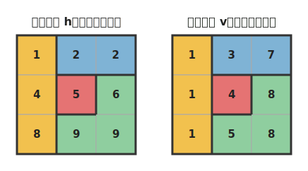
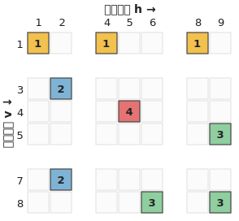
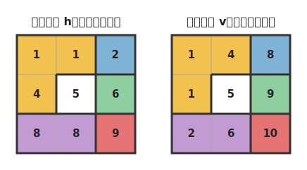
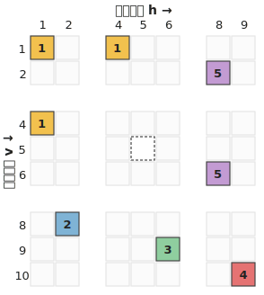

# 四角版プロトタイプ（格子グラフ）

**状態: プロトタイプ。** ブランチ `square-grid-prototype` で試作中。
三角分割（ハニカム）の代わりに**四角分割（格子グラフ）**で 2軸ラベル表を作り、
[docs/09](09_アイデア_2軸ラベル表.md) の議論が成り立つかを確認する。

- 格子モデル: [fourcolor/square.py](../fourcolor/square.py)（`SquareGrid`、次数≤4）
- 2軸表: [fourcolor/squaretable.py](../fourcolor/squaretable.py)
- サンプル: `python samples/square_sample01.py`（3×3 の K4）、
  `python samples/square_sample02_point.py`（5カ国が1点・無色ノード）
- テスト: [tests/test_square.py](../tests/test_square.py)

## 三角版と共有するもの

セルの値の意味（`≥1` 有色 / `0` 無色 / `-1` 空き / `-2` 区切り）、採番規則
（True→同・False/None→+1、グループ間 +2）、`AxisTable` クラスはそのまま再利用。
違いは**スキャン順だけ**:

- 横ラベル: 各行を左→右
- 縦ラベル: 各列を上→下（三角の**ジグザグが不要**）

## すっきりする点（確認済み）

1. 縦スキャンのジグザグが消える。
2. 辺の方向が横・縦の2つだけ。横ラベル＝横の辺、縦ラベル＝縦の辺と1対1。
3. **各ブロックが最大1セル**。四角では「列ブロック＝格子の行」「行ブロック＝
   格子の列」で交点はマス1個。三角の ▲▽ ペア（最大2セル・「／」向き）が消え、
   ただの格子配置になる。

## 検証結果（test_square.py、3地図）

K4（3×3）・縦縞・4×4ブロックの地図で、いずれも:

- 等式（同じ横/縦ラベル）の推移閉包 = 国の分割 ✓
- 差1（横/縦ラベル）の異色ペア = baseline の国境 ✓
- ブロック内の最大セル数 = 1 ✓

→ 中心の議論（2軸表が地図と同値、色を減らす作業場になる）は四角でも**破綻しない**。

## 図で見る（サンプル01）

横ラベル h と縦ラベル v を同じ格子グラフに書いた2パターン。マスの色は国の色、
中の数字がラベル値、太線が国境（生成: `python samples/square_figures.py`）:

この2つを軸にして作った表。ヘッダ = 横ラベル h、行インデックス = 縦ラベル v、
セルは対応マスと同じ国の色（数字は仮色値）、空白の列・行が区切り:

三角版（docs/09）と違い、縦スキャンがジグザグでなく素直な列スキャンなので、
各ブロックがちょうど1マス（▲▽ペアが無い）になっているのが図でも分かる。

## 無色ノードの例（サンプル02）

四角格子の格子点には4マスしか集まれないので、**5カ国以上が1点に集まると
無色ノードが必要**になる（三角は6カ国まで native）。サンプル02 は X を中心に
5カ国 A〜E が輪 C5 をなす例（無色マスは破線・白、ラベルは持つが色は持たない）:

2軸表（無色マスは `0`＝白の破線セル）。三角版（表現B）と同じく、無色ノードも
列・行を1つ占めるので、点で接するだけの非隣接（A-C など）は差1にならず正しく
表現される:

等式の推移閉包=国、差1=国境（=C5）、ブロック最大1セルは、無色ノード入りでも成立
（[test_square.py](../tests/test_square.py) で機械検証）。

## 失うもの・新たなデメリット（docs/09 §6 周辺の議論より）

- **次数が4**（三角は3）。局所更新には bounded で問題ないが、次数3の旨みは無い。
- **1点に集まれる国が4まで**（格子点に4マス。三角は6）。5カ国以上の点は無色
  ノードが必要になり、busy な地図で無色ノードが増える。
- **対角連結の厄介さ**（市松模様の点で同一国が斜めに分断される古典問題）。
- **Tait の3辺彩色との接続を失う**（[docs/08](08_実験2A_方向とビット分解.md) は
  3方向・cubic 固有）。
- 三角版の構造／健全性の議論（docs/09 §5,6、exp3〜5）は組み直し。
  四角は1セルブロックなので「格子＋併合は平面か」をより裸の形で観察できる利点もある。

## 未実装（プロトタイプの範囲外）

- 描画（render 相当の3面図）、健全性の検討の四角版（1セルブロックでの再検討）。
